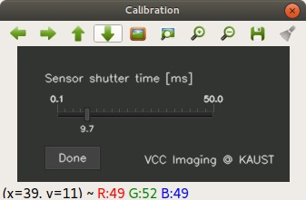
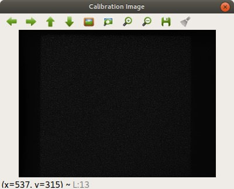
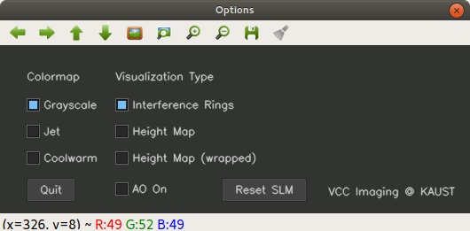
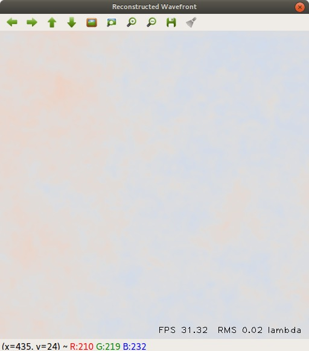
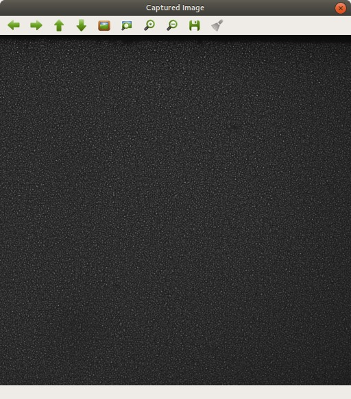
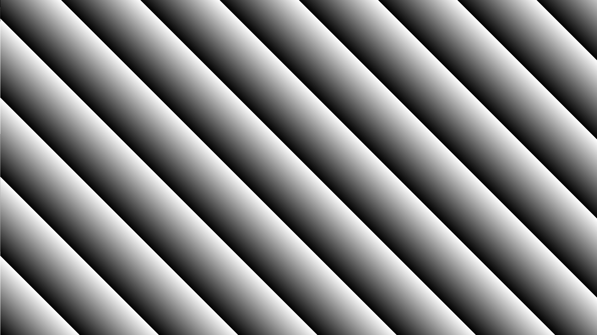
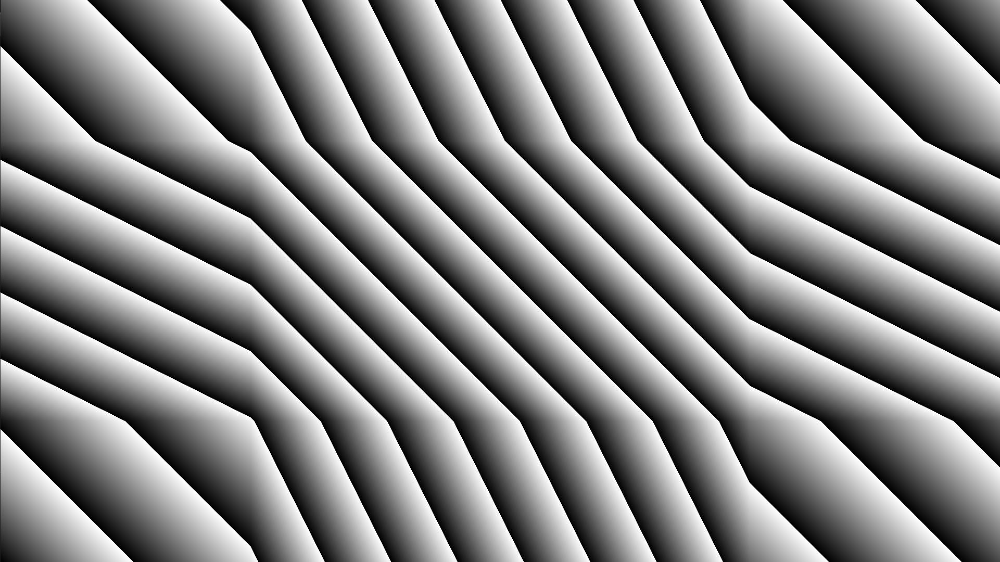

## Program Guide

These are the software details on how to compile and setup a CUDA code project for our coded wavefront sensor series papers:

- Ultra-high resolution coded wavefront sensor (*Optics Express 2017*).
- Megapixel adaptive optics: towards correcting large-scale distortions in computational cameras (to appear in *SIGGRAPH 2018*)

### Installation
The code is written (naively) with C++, CUDA, and some MATLAB scripts. OpenCV and OpenGL are used for visualization and the SLM control. The code hierarchy is managed by CMake. 

#### Prerequisites

- CUDA Toolkit 8.0 or above;
- CMake 2.8 or above;
- OpenCV 3.0 or above (with CUDA-support is necessary; with Qt-support is preferable);
- GLFW 3.2.1 or above;
- FlyCapture2 SDK from PointGrey;
- MATLAB.

Make sure you complete above dependencies before proceeding.

#### Linux

Additional prerequisites:

- GNU make;
- GNU Compiler Collection (GCC);
- pkg-config. On Ubuntu `$ sudo apt-get install pkg-config`.

Simply run `setup.py` to get it done. You can also build it manually, for example:

```shell
$ cd <the folder contains this README.md>
$ mkdir build
$ cd build
$ cmake ..
$ make -j8
$ sudo make install
```

#### Windows

Here we only provide one compilation approach. You can do any modifications for your convenience at will.

Please use Visual Studio 2015 (or below) as native compiler and build the project solution. We found for our CMake file there were issues with VS 2017 and CUDA 9.1. A safe option is to have VS 2015 and CUDA 9.0. 

Steps:

- Add GLFW, OpenCV to the system `PATH` variable. The specific path depends on your installation option.

- Run `cmake-gui` and configure your Visual Studio Solution (select `Visual Studio 14 2015 Win64` as generator for the project). If CMake failed to auto-detect the paths:

  - Manually find the path (depends on specific installation option), and modify `./CMakeLists.txt`;
  - Then, try to configure and generate the project again.

  If success, you will see `AO.sln` be generated in your build folder.

- In Visual Studio 2015 (opened as Administrator), build the solution. To install, in Visual Studio:

  - Build -> Configuration Manager -> click on Build option for INSTALL;
  - Then build the solution.

  If success, you will see new folders `bin`, `include` and `lib` appear.

### Usage

#### Logic

- All the AO system related data is stored in `./temp` .

- Real applications are in `./projects`, and test applications are in `./tests`.

- To make sure a successful AO run, run the applications in sequential as:

  1. `./bin/settings`
  2. `./bin/AO_xy_alignment`
  3. `./bin/AO_closedloop`

  After you have run `settings` and `AO_xy_alignment`, and have the configurations saved in `./temp`. you can run `AO_closedloop` freely.

#### Projects

- `settings` sets the shutter time (`shutter_time.txt`), auto-detects the SLM size (`SLM_sizes.txt`) and sensor size (`sensor_sizes.txt`), and writes the results to `./temp`.

|  |  |
| :----------------------------------------------------------: | :----------------------------------------------------------: |
| *Shutter time setting: drag the bar and adjust for a best sensor shutter time.* | *Corresponding image window: visualize captured image under current shutter time.* |

- `AO_xy_alignment` implements the method described in Figure 9 in the AO paper. Please follow below order:
  - Run  `gen_microlensarray.m` to generate the microlens array images;
  - Run binary `AO_xy_alignment;`
  - After obtaining the data, run `gen_sensor_points.m` to get the calibration result. The perspective matrix T will be written in `./temp/perspective_T.txt`.

- `AO_closedloop` is the major application to run our AO system. Please follow below order:

  - Run `gen_SLM_groudtruth.m` to generate a SLM image. This image will be regarded as a pre-load image to the SLM. The default is the zero phase image (`SLM_gt_pla_0.png`).
  - Then run the binary application `AO_closed_loop`.

  First you need to do a reference captured, as the same in `settings`. Then:

|                    |
| :----------------------------------------------------------: |
| *Option panel. You can choose three different colormaps, and visualize the wavefront in terms of interference rings, height map, or wrapped height map. For AO control, you can click on `AO On` to close the loop, or `Reset SLM` to reset the SLM to null phase. Click `Quit` to exit the application.* |

|      |  |
| :----------------------------------------------------------: | :----------------------------------------------------------: |
| *Recovered wavefront. (under hardware synchronization)* | *Captured image.* |

#### Tests

- `background_SLM` demonstrates how to utilize CUDA-OpenGL interop to render an image on SLM. You will see, on the SLM:


- `hardware_trigger` tests if your sensor is hardware synchronized to the SLM. Note:
  - BNC cable for SLM. The cable will output a V-Sync signal (60 Hz fps) from your PC. For Holoeye it is an *undocumented option*: ask the Holoeye guys for a guide.
  - GPIO cable for the sensor. You need to choose a corresponding GPIO cable for your specific camera model. We used [8 pin GPIO](https://www.ptgrey.com/1-meter-circular-8-pin-pre-wired-gpio-hirose-connector).
  - Check what type of trigger you need. In code `flycapture2_helper_functions.h`, we configure the hardware synchronization to be mode 14 through GPIO3. See PointGrey technical paper for a full reference (for our specific camera model GS3-U3-15S5M-C, see P52 of [GS3 Tech Manual](https://www.ptgrey.com/support/downloads/10125)).
- `shader` tests if our shaders work. You will see, on the SLM:


- `solver_accuracy` tests the numerical accuracy between CPU and GPU:
  - `test_fista_rof` implements the ROF denoising method using the famous [FISTA algorithm](https://people.rennes.inria.fr/Cedric.Herzet/Cedric.Herzet/Sparse_Seminar/Entrees/2012/11/12_A_Fast_Iterative_Shrinkage-Thresholding_Algorithmfor_Linear_Inverse_Problems_(A._Beck,_M._Teboulle)_files/Breck_2009.pdf); this feature is undocumented in our paper, but we provide it for your reproduction. Run:
    - The binary `test_fista_rof` first;
    - Then `test_fista_rof.m` to visualize results in MATLAB.
  - `test_solver_accuracy` tests our wavefront solver. Run:
    - The binary `test_solver_accuracy` first;
    - Then `test_wavefront_solver.m` to visualize results in MATLAB.

